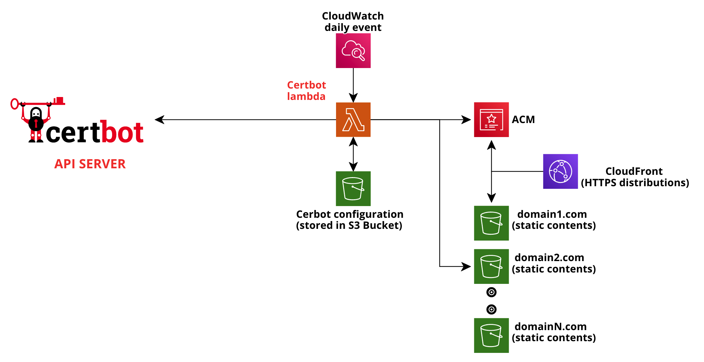

# certbot-lambda

A lambda function to get and renew FREE SSL certificates using Cerbots. I'm using it to automatically request and renew all SSL certificates of my CloudFront websites.

* Automatic S3 hosting verification
* ACM certificate import (CloudFront)
* CloudWatch daily event to check if renew is needed
* CloudFormation template to build stack

